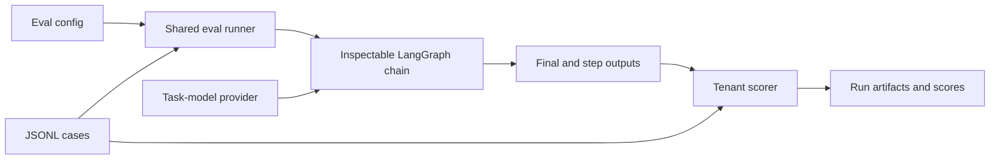
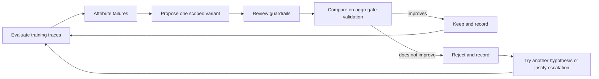
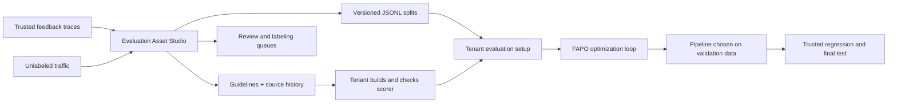

# Fully Automated Prompt Optimization and Evaluation Asset Studio: Tutorial and Stress Test

This report analyzes the [FAPO paper, arXiv v2](https://arxiv.org/html/2606.19605), the repository's `main` snapshot at [`ed965ae5`](https://github.com/cisco-foundation-ai/fully-automated-prompt-optimization/tree/ed965ae5a08c8f04cfb36cb5170c0734cc1e3d6d), and the proposed `evaluation-asset-studio` snapshot at [`ce7f832f`](https://github.com/cisco-foundation-ai/fully-automated-prompt-optimization/tree/ce7f832fc96a4e8e7a5ef46fad49d1c24e15c50c). The feature branch is a direct five-commit descendant of `main`, changing 38 files by 12,928 insertions and 27 deletions. All runtime tests in this audit were offline; no live rubric-model, task-model, embedding, or tenant-data call was made.

The report has two parts. Part I is a concise tutorial: it explains FAPO, the new upstream evaluation-asset workflow, and their relationship. Part II is the stress test: it separates reproduced defects from immediate engineering improvements, open empirical questions, inherited FAPO limitations, and properties that already work correctly.

Part I explains the intended workflow and the verified happy path; it does not imply that every documented guardrail is enforced in the audited snapshot. Part II identifies those gaps, assigns release gates, and ends with a remediation and research program. Readers seeking only the decision can start with Section 12; readers implementing fixes should continue through Sections 13, 14, and 19.

## Part I — Tutorial

### 1. FAPO in one sentence

Fully Automated Prompt Optimization (FAPO) is an evidence-guided search procedure over versions of a large language model (LLM) workflow: run the workflow, inspect where it failed, make one allowed change at the cheapest useful level, review the change, measure it on held-out data, and repeat.

The key idea is that the object being optimized is a pipeline, not necessarily one prompt. A pipeline may contain retrieval, several LLM calls, deterministic processing, tool use, and final formatting. If retrieval never found the relevant document, rewriting the final-answer prompt is unlikely to solve the problem. Conversely, if the correct answer is present but wrapped in unparseable prose, a prompt or formatting fix may be sufficient. FAPO records intermediate outputs so that the optimizer can distinguish these cases.

An intuitive mathematical view is useful. Let `v` be one allowed pipeline variant, `D` a set of evaluation cases, and `S` the tenant-defined scorer. For case `i`, `x_i` is the model-visible input, `y_i` is protected expected evidence supplied only to the scorer, and `z_i(v)` is the recorded sequence of intermediate outputs. FAPO measures

$$
Q(v; D)=\frac{1}{|D|}\sum_{i=1}^{|D|}S(v(x_i), y_i, z_i(v)).
$$

It then searches a discrete, tenant-constrained set of variants for a higher validation score. This is black-box search, not gradient descent, and the paper does not claim that it finds a global optimum or converges monotonically. The important methodological choice is how the next variant is chosen: recurring failures and their attributed pipeline location guide one scoped edit.

### 2. The four roles

A tenant is one task-specific workspace containing the data, chain, scorer, configuration, and change policy used by the shared FAPO runtime. A guideline is an evidence-backed statement of desired behavior; a rubric turns guidelines into case-level scoring requirements; a scorer is executable code that applies those requirements; and an oracle is the broader source of trusted correctness evidence, which may include deterministic checks, references, tools, or calibrated human or model judgments.

FAPO is easiest to understand by separating the roles that can otherwise be conflated.

| Role | Responsibility | Trust boundary |
| --- | --- | --- |
| Optimizer/orchestrator | Reads the workspace, analyzes run artifacts, authors variants, runs evaluations, and decides whether to escalate | Separate from the model being optimized; Claude Code in the paper, with Codex workflow prompts added in the current repository |
| Task model | Executes the tenant's LLM nodes | The object whose pipeline performance is being optimized |
| Scorer | Converts final and optionally intermediate outputs into a finite score from 0 to 100 plus a breakdown | Tenant-defined; it may be deterministic, model-based, or composite |
| Variant reviewer | Checks scope, leakage, placeholders, compatibility, and unintended changes before evaluation | A procedural guardrail; in a single-agent Codex run it is a fresh-eyes phase, not a separately enforced process |

This separation matters. An optimizer can improve a pipeline that uses a different model provider, and the scorer may use a third model as an optional judge. A score increase is evidence only for the measured pipeline, scorer, split, and model settings; it is not automatically evidence of broader quality.

### 3. The tenant is the unit of work

A FAPO tenant packages the task-specific material around a shared runtime. At minimum it supplies:

- A JSON Lines (JSONL) dataset containing `case_id`, `task_type`, `context`, `expected`, and `metadata`.
- A LangGraph chain whose named nodes write intermediate `step_outputs` and a final `output_text`.
- A scorer that validates each case and returns `composite_score` plus `score_breakdown`.
- An evaluation configuration that chooses the dataset, chain, provider settings, scorer, prompts or skills, parameters, and output directory.

The optimization workspace adds numbered prompt, skill, parameter, or chain variants; a tenant playbook defining allowed changes; and append-only iteration history. The shared runtime evaluates a specified configuration. The external optimizer, rather than the Python runtime itself, owns variant creation, validation-based selection, escalation, and the iteration record.

The paper's original search levels are prompt text, chain parameters, and chain structure. The current repository extends the textual level to agent skills and includes Model Context Protocol (MCP) and other tool-using examples. Those are useful current capabilities, but they should not be retroactively described as all having been evaluated in the paper.

### 4. What one evaluation run does

The evaluation runner loads and validates the config, dataset, chain factory, provider, and scorer. Each case begins with a copy of its `context` plus empty final and step outputs. The runner streams the LangGraph chain, merges each node's state update, records node timings, and calls the tenant scorer with the protected `expected` object and the collected outputs. It finally writes `progress.json`, `run_config.json`, `results.jsonl`, and `summary.md`.

The engine enforces basic types, path existence, scorer inheritance, and numeric score validity. It does not understand the semantics of `expected`; only the tenant scorer does. It also does not technically enforce all research policies. Split visibility, scorer immutability, one-change discipline, validation-only selection, and reviewer independence primarily live in playbooks and agent instructions.

### 5. The FAPO optimization loop

The paper presents an operational six-stage loop rather than a formal optimizer with a fixed proposal distribution or stopping theorem.

1. **Evaluate.** Run the current variant on training cases and collect scores plus intermediate evidence.
2. **Attribute.** Find the earliest likely failure point and group recurring failures by cause and addressable level.
3. **Propose.** Select a dominant failure cluster and create one scoped candidate. Prefer a prompt or skill edit; use parameters or structure only when evidence and tenant scope justify escalation.
4. **Review.** Check the candidate for leakage, scope violations, broken placeholders, scorer changes, and compatibility problems.
5. **Compare.** Evaluate the candidate and compare it with the current best using aggregate validation results.
6. **Iterate or escalate.** Keep an improvement, record the outcome, try another focused change, or justify moving to a more expensive level. Use test only for the final report or release gate.

The loop's scientific hygiene depends on three boundaries: individual held-out cases must not enter authoring context, candidate selection must use validation rather than test, and the scorer must stay fixed. The paper describes individual training cases as visible and validation/test as aggregate-only. That reduces direct leakage, although repeated aggregate validation queries remain an adaptive data-analysis concern discussed later.

### 6. What the paper demonstrates

| Scope | Reported result | Appropriate interpretation |
| --- | --- | --- |
| Six benchmarks × three task models | FAPO exceeds the reproduced GEPA baseline in 15 of 18 comparisons; mean FAPO–GEPA difference is +14.1 percentage points | Broad evidence for the evaluated package, not a component-level causal claim |
| HoVer and IFBench, where permitted structural changes were used | 6 of 6 wins; mean gain +33.8 points | Strong evidence that the broader action space helped on these configurations |
| Remaining prompt-only comparisons | 9 of 12 wins | More mixed evidence when the action spaces are closer |
| CTIBench-RCM prompt-only experiment | Test gains of +4.0, +7.1, and +2.0 points across the three models | Positive task-specific result outside the six-benchmark aggregate |
| AIME against GEPA | 0 of 3 wins; change from pristine baselines described as inconclusive | A clear counterexample to universal superiority |

These results support the narrower conclusion that an inspectable, attribution-guided optimizer with a broader action space can outperform a fixed-chain prompt optimizer on the tested configurations. They do not isolate the causal contribution of attribution, review, prompt-first ordering, or the optimizer model because the paper contains no corresponding ablations. They also do not establish equal compute or cost, deployment robustness, exact rerun determinism, or formal statistical significance. Each table cell uses only three trials; a non-overlap between mean ± trial-standard-deviation ranges is not a confidence interval or a hypothesis test.

### 7. What Evaluation Asset Studio adds

FAPO assumes that someone has already built evaluation cases and a scorer. Evaluation Asset Studio works earlier: it tries to build versioned cases (named, saved revisions) from a small file of trusted feedback traces (records with human feedback) and a larger file of unlabeled traffic (ordinary application logs without correctness judgments).

Imagine a support bot. A complaint saying “the refund window is 30 days, not 60” can support a correctness rule. Ten thousand unlabeled refund questions show that refunds are common, but they do not reveal the correct policy. This gives the Studio three evidence rules:

- Trusted feedback may support a rule about correct behavior.
- Unlabeled traffic shows what users ask and whether the dataset covers it; it does not supply correct answers.
- An earlier assistant answer provides context, not truth.

Both JSONL source files must follow the `fapo-evaluation-input-v1` contract (the required field names, types, and allowed values). A source-specific adapter may first convert a vendor export—for example, joining trace fragments and standardizing tool names—into that common format. After this boundary, shared code, not an agent, performs every dataset-building step.

### 8. The eight Studio stages

The pipeline has eight stages. Each answers one practical question and saves artifacts (output files) for inspection.

| Stage | What happens | Result |
| --- | --- | --- |
| 1. Validate raw input | Copy both files, check every row against the contract, and record a file fingerprint (hash) | Validated copies and a source summary |
| 2. Standardize records | Fill documented defaults, redact selected text, and convert rows to one internal shape | Prepared feedback and traffic records |
| 3. Build evaluation guidelines | Extract individual facts from feedback and combine compatible facts into grading rules, while recording where each rule came from | Guidelines, trusted request types, and trusted cases |
| 4. Group similar requests | Turn request text into similarity vectors (number lists used to compare meaning), then use fixed-count cosine k-means (an algorithm that creates a chosen number of groups) within each request-handling path | An inventory of traffic groups and representative examples |
| 5. Check coverage | Within the same request-handling path, match each traffic group to a trusted request type only when similarity and minimum-evidence cutoffs pass; otherwise queue examples for labeling | Match decisions, a coverage report, and a review queue |
| 6. Propose labels | For supported groups only, use representative traces to propose a rubric (a grading checklist), mark it for review, and apply it to real traffic cases | Proposed rubrics, labels, and cases |
| 7. Optionally create synthetic cases | Generate artificial cases only for supported request types, then apply mechanical validity and duplicate filters | Accepted and rejected cases with an audit trail |
| 8. Split the dataset | Keep records with the same exact `group_id` together, reserve a trusted regression set (a final safety check), hold conflicts for review, and divide the rest into train, validation, and test | Published splits plus review-only and source-specific files |

Saved stage status is meant to support resume (restart and continue). If a decision changes, the system should rerun from the first affected stage; a child version should copy its parent's saved work and either reuse or rebuild the traffic groups. The audited code does not yet make those promises safe: it trusts a `completed` status without checking the saved files and can alter a completed asset in place. EA-05 explains this defect.

### 9. How the two systems connect

The Studio does not replace FAPO. It prepares evaluation data; FAPO then uses that data to improve a prompt or pipeline.

Studio does not create runnable scoring code. It writes rubric text, suggested checks, tool expectations, and reference outputs into each case's `expected` field—like writing an answer key and grading instructions. The tenant must still implement a scorer that applies those instructions and calibrate it (check its decisions against trusted human or programmatic judgments). The files therefore fit FAPO's input format, but they do not form a complete runnable tenant by themselves.

### 10. Point-by-point comparison

The simplest distinction is: **Studio builds the test; FAPO improves the system taking the test.**

| Question | Original FAPO | Evaluation Asset Studio | Connection |
| --- | --- | --- | --- |
| When does it run? | After a tenant already has data and scoring | Before evaluation and optimization | Studio is an earlier step |
| What must already exist? | Dataset, chain, scorer, prompts, configuration, and change rules | Two contract-valid source files, Studio settings, and model access; a chain and scorer still come later | Studio reduces dataset setup, not all tenant setup |
| What says an answer is correct? | The case's `expected` data plus executable scorer | Guidelines derived from trusted feedback | Studio helps define what “correct” means |
| What shows user demand? | The existing evaluation cases | The kinds and volumes of requests found in unlabeled traffic | Studio adds a view of coverage |
| What does it inspect? | Failed cases and pipeline steps | Feedback facts, guidelines, request types, and traffic groups | The two systems diagnose different layers |
| Which models are involved? | An optimizer, task model, and sometimes a judging model | A guideline-writing model and an embedding model (which turns text into similarity vectors) | Studio adds model calls before FAPO runs |
| What may the agent change? | Allowed prompts, skills, parameters, or chain structure | The agent operates and reviews; shared code performs data transformations | Studio gives the agent less direct authority |
| What decisions vary? | Pipeline variants | Models, number of groups, match cutoffs, synthetic generation, and split seed (the value that makes the split repeatable) | Studio configures a build rather than searching pipeline variants |
| How is review used? | A candidate pipeline change is reviewed before evaluation | Generated cases carry review labels and queues | Similar intent, but Studio does not yet enforce approval before publication |
| How are splits protected? | Separate files/configs plus access rules followed by the optimizer | The main Stage 8 keeps each `group_id` in one split and builds a trusted regression set | Studio adds a useful core safeguard |
| How is history saved? | Numbered variants and iteration records | Asset workspaces, checkpoints, histories, and parent–child versions | Both aim to make changes traceable |
| What comes out? | A selected pipeline and score history | Dataset files, guidelines, reports, queues, and parent–child history | Studio's output feeds FAPO |
| What is the main risk? | Improving the wrong or leaked score | Building a score from unsupported or leaked evidence | An early Studio error can be amplified by FAPO |

## Part II — Stress Test and Analysis

### 11. Audit method and evidence standard

The audit used four checks:

1. **Promises versus code.** We traced each documented guarantee into the implementation and tests.
2. **Branch comparison.** We separated new Studio behavior from inherited FAPO behavior and later changes not covered by the paper.
3. **Offline tests.** With API credentials removed, `main` passed 330 tests, skipped 2, and deselected 8 integration tests (tests that require external systems). The Studio branch passed 387, skipped 2, and deselected 8; its focused files passed 61.
4. **Adversarial probes.** We supplied deliberately difficult inputs that normal tests omit—for example, deleting a file from an asset still marked `completed`. These probes reproduced the defects listed below and five inherited FAPO runtime gaps.

Passing the standard suite shows that expected paths work. It does not prove that harmful edge cases are impossible: most reproduced defects had no negative test, and one end-to-end test checks the `review_required` label but still permits those cases to be published.

We classify results as **confirmed defects** (reproduced or unavoidable from the code), **immediate improvements** (bounded fixes), **open research problems** (questions needing experiments), or **strengths** (properties already enforced). Release priorities are separate: **P0** blocks merge and use of protected tenant data; **P1** blocks claims that an asset is ready for FAPO; **P2** blocks broad empirical or production-effectiveness claims, but not a safely bounded prototype.

### 12. Consolidated verdict

The idea is viable and tackles a real bottleneck: FAPO cannot optimize reliably until a tenant has useful cases and a meaningful scorer. Studio's basic evidence rule is good, and its main splitting step is stronger than FAPO's inherited split handling.

The audited code is not yet ready to promise an independent regression set, enforced review, unchangeable versions, or identity-safe redaction. The largest research flaw is easy to state: it learns grading rules from all trusted feedback and only afterward reserves some feedback for validation, test, and regression. A rule found only in saved test data can therefore appear in training. The main engineering risks are publication of unapproved AI-generated cases, raw files that Git may track, redaction that changes IDs, and unsafe resume behavior.

These are repairable problems, not proof that the idea is infeasible. Until they are fixed and tested, Studio should be described as a versioned dataset-drafting tool, not as a producer of optimization-ready evaluation assets. Section 18 lists the good foundations that should remain intact.

### 13. Confirmed Evaluation Asset Studio defects

| ID | What goes wrong | Evidence | Why it matters | Gate |
| --- | --- | --- | --- | --- |
| EA-01 | Grading rules are learned before evaluation groups are reserved | Unique test phrase leaked from regression into training | Saved evaluation evidence can shape training | P0 |
| EA-02 | `review_required` is only a label | Six unapproved derived cases were published | FAPO may train or select on unchecked labels | P0 |
| EA-03 | The actual asset folders are not ignored by Git | Reproduced with `git check-ignore` | Protected feedback may be committed | P0 |
| EA-04 | Redaction also rewrites IDs | Distinct email/IP-shaped IDs became identical | Records and split groups can collapse | P0 |
| EA-05 | A completed asset can change or lose files unnoticed | Both behaviors reproduced | One version ID can mean different data | P0 |
| EA-06 | Format-valid feedback may contain no usable correctness rule | Established from contract and code | The model must invent a rule or fail | P1 |
| EA-08 | Near-duplicate real cases are not grouped before splitting | Identical cases crossed train/validation | Information can leak across splits | P1 |
| EA-09 | Alternate public commands use different splitting rules | One `group_id` crossed train/validation | The same product name has incompatible behavior | P1 |

EA-07 is absent because Section 14 reclassifies the scorer handoff as a P1 readiness boundary, not a defect in the documented architecture.

#### EA-01: saved evaluation feedback shapes training rules

**What happens.** Stage 3 reads all trusted feedback and turns it into grading rules stored in each case's `expected` field. Stage 8 divides cases into train, validation, test, and regression only afterward. See [`pipeline.py:320–455`](https://github.com/cisco-foundation-ai/fully-automated-prompt-optimization/blob/ce7f832fc96a4e8e7a5ef46fad49d1c24e15c50c/src/hephaestus/evaluation_assets/pipeline.py#L320-L455), [`pipeline.py:1362–1617`](https://github.com/cisco-foundation-ai/fully-automated-prompt-optimization/blob/ce7f832fc96a4e8e7a5ef46fad49d1c24e15c50c/src/hephaestus/evaluation_assets/pipeline.py#L1362-L1617), and [`pipeline.py:838–991`](https://github.com/cisco-foundation-ai/fully-automated-prompt-optimization/blob/ce7f832fc96a4e8e7a5ef46fad49d1c24e15c50c/src/hephaestus/evaluation_assets/pipeline.py#L838-L991).

**Example.** We placed the unique phrase `HOLDOUT_ONLY_CRITERION_7F3A` only in feedback record `f2`. The split put `f2` in `regression_trusted`, yet the phrase appeared in a training case's `expected` field. This is a canary test: a planted phrase reveals whether information crossed a boundary.

**Why it matters.** Keeping each conversation in one split prevents direct duplication, but it does not keep the learned grading rules independent. FAPO can train against a rule learned from the very data later used to judge it.

**Fix and check.** Assign trusted groups to train, validation, test, and regression before learning any guideline. Build training guidelines only from training feedback. If every group needs its own rubric, use cross-fitting (build a group's rubric without using that group's evidence). Plant unique phrases in every held-out split (data saved for evaluation) and verify that none reaches any training guideline, inferred rubric, synthetic prompt, or `expected` field, even indirectly.

#### EA-02: “review required” does not stop publication

**What happens.** AI-inferred and synthetic cases are tagged `review_required`, but Stage 8 still writes them into train, validation, and test. There is no approve/reject action or approved-only filter. See [`pipeline.py:1705–1736`](https://github.com/cisco-foundation-ai/fully-automated-prompt-optimization/blob/ce7f832fc96a4e8e7a5ef46fad49d1c24e15c50c/src/hephaestus/evaluation_assets/pipeline.py#L1705-L1736) and [`pipeline.py:838–972`](https://github.com/cisco-foundation-ai/fully-automated-prompt-optimization/blob/ce7f832fc96a4e8e7a5ef46fad49d1c24e15c50c/src/hephaestus/evaluation_assets/pipeline.py#L838-L972).

**Example and risk.** The probe published six pending cases: five labels inferred for real traffic and one synthetic case. A generated rubric is only a guess about correctness. Training or selecting a pipeline with that guess can reward the wrong behavior.

**Fix and check.** Store an unchangeable `pending`, `approved`, or `rejected` decision for the exact case and rubric version (identified by a content fingerprint). Publish trusted and approved cases only; keep pending cases in a review bundle. With only pending cases, zero derived rows should be published. Editing an approved case or rubric should return it to pending.

#### EA-03: Git can track the folders that hold protected data

**What happens.** `.gitignore` ignores an older folder layout, but Studio now writes raw feedback and generated assets under `evaluation_assets/<id>/stages/`. See [`.gitignore:46–57`](https://github.com/cisco-foundation-ai/fully-automated-prompt-optimization/blob/ce7f832fc96a4e8e7a5ef46fad49d1c24e15c50c/.gitignore#L46-L57) and [`workspace.py:27–79`](https://github.com/cisco-foundation-ai/fully-automated-prompt-optimization/blob/ce7f832fc96a4e8e7a5ef46fad49d1c24e15c50c/src/hephaestus/evaluation_assets/workspace.py#L27-L79).

**Example.** `git check-ignore` returned status 1 for the real Stage 1 feedback path, meaning Git did not ignore it. The obsolete path was ignored.

~~**Fix and check.** Ignore the entire current asset runtime tree—raw files, stages, state, history, manifests (asset summaries), parent–child records, and review queues—except intentional placeholders. Add a test that runs `git check-ignore` on representative protected paths. If Google Cloud Storage or another backend is promised, implement it or clearly document that storage is currently local.~~

#### EA-04: redaction can merge different records

**What happens.** The contract says `record_id` and `group_id` must not change. Stage 2 instead redacts every string field, including IDs. See the [input contract](https://github.com/cisco-foundation-ai/fully-automated-prompt-optimization/blob/ce7f832fc96a4e8e7a5ef46fad49d1c24e15c50c/docs/processes/evaluation-input-contract.md#L29-L33), [`pipeline.py:1294–1323`](https://github.com/cisco-foundation-ai/fully-automated-prompt-optimization/blob/ce7f832fc96a4e8e7a5ef46fad49d1c24e15c50c/src/hephaestus/evaluation_assets/pipeline.py#L1294-L1323), and [`pipeline.py:2332–2343`](https://github.com/cisco-foundation-ai/fully-automated-prompt-optimization/blob/ce7f832fc96a4e8e7a5ef46fad49d1c24e15c50c/src/hephaestus/evaluation_assets/pipeline.py#L2332-L2343).

**Example.** The record IDs `alice@example.com` and `bob@example.com` both became `<email>`; the group IDs `10.0.0.1` and `10.0.0.2` both became `<ip_address>`. Two distinct records or conversations can therefore look identical.

~~**Fix and check.** Make redaction schema-aware (apply it only to approved content fields), preserve identity and routing fields byte-for-byte, and recheck unique IDs and groups afterward.~~ The privacy policy also needs broader coverage: the current code finds only email and IPv4, not names, phones, addresses, credentials, tokens, health or payment data, or IPv6.

#### EA-05: “completed” does not mean fixed or intact

**What happens.** A completed asset can be revised in place. The revision deletes downstream files before it safely records the new state. Resume then skips any stage marked `completed` without checking that its files still exist or match their fingerprints. An in-memory running-task list also cannot stop a second command or server process. See [`workspace.py:564–657`](https://github.com/cisco-foundation-ai/fully-automated-prompt-optimization/blob/ce7f832fc96a4e8e7a5ef46fad49d1c24e15c50c/src/hephaestus/evaluation_assets/workspace.py#L564-L657), [`workspace.py:701–726`](https://github.com/cisco-foundation-ai/fully-automated-prompt-optimization/blob/ce7f832fc96a4e8e7a5ef46fad49d1c24e15c50c/src/hephaestus/evaluation_assets/workspace.py#L701-L726), [`pipeline.py:200–247`](https://github.com/cisco-foundation-ai/fully-automated-prompt-optimization/blob/ce7f832fc96a4e8e7a5ef46fad49d1c24e15c50c/src/hephaestus/evaluation_assets/pipeline.py#L200-L247), and [`service.py:18–89`](https://github.com/cisco-foundation-ai/fully-automated-prompt-optimization/blob/ce7f832fc96a4e8e7a5ef46fad49d1c24e15c50c/src/hephaestus/evaluation_assets/service.py#L18-L89).

**Examples.** Changing `match_threshold` altered a completed asset and deleted its manifest and published data. In another probe, we deleted `intent_inventory.jsonl`; resume still returned `completed`, made no provider call, and did not restore the file.

**Why it matters.** One `asset_id` can silently refer to different data. A crash can leave a completed-looking asset with missing files, while two processes can overwrite each other's work.

**Fix and check.** Make released assets read-only and require a child version for changes. Before deletion, durably record what will be rebuilt. Use a cross-process lock (one writer at a time across commands), verify every stage's input and output fingerprints on resume, and restart from the first mismatch. Publish train, validation, test, and regression together with one all-or-nothing version switch.

#### EA-06: valid input may still be too weak to teach a rule

**What happens.** The contract accepts a thumbs-up or thumbs-down with no explanation, correction, or source. The code nevertheless requires every feedback record to support a scoreable guideline and publishes every format-valid row as trusted. See [`evaluation-input-contract.md:100–116`](https://github.com/cisco-foundation-ai/fully-automated-prompt-optimization/blob/ce7f832fc96a4e8e7a5ef46fad49d1c24e15c50c/docs/processes/evaluation-input-contract.md#L100-L116) and [`pipeline.py:1362–1460`](https://github.com/cisco-foundation-ai/fully-automated-prompt-optimization/blob/ce7f832fc96a4e8e7a5ef46fad49d1c24e15c50c/src/hephaestus/evaluation_assets/pipeline.py#L1362-L1460).

**Why it matters.** A reaction does not explain what was right or wrong. The model must invent a rule, produce an empty rule, or fail. The code records conflicts and uncertainty but still activates the resulting guideline; documented holds for unsafe, contradictory, irreproducible, or privacy-blocked feedback are not implemented.

**Fix and check.** Before guideline creation, separately ask whether the file is well formed and whether its evidence is safe and sufficient to trust. Send weak or conflicting records to review with clear reason codes. An unexplained rating should create no active guideline unless a programmatically detectable failure or correction supplies the missing evidence.

#### EA-08: near-identical cases can cross splits

**What happens.** The main Stage 8 keeps matching `group_id` values together, but it does not find trusted or inferred cases that say the same thing under different IDs. Its text-overlap duplicate check applies only to synthetic candidates. See [`pipeline.py:838–991`](https://github.com/cisco-foundation-ai/fully-automated-prompt-optimization/blob/ce7f832fc96a4e8e7a5ef46fad49d1c24e15c50c/src/hephaestus/evaluation_assets/pipeline.py#L838-L991) and [`pipeline.py:2256–2287`](https://github.com/cisco-foundation-ai/fully-automated-prompt-optimization/blob/ce7f832fc96a4e8e7a5ef46fad49d1c24e15c50c/src/hephaestus/evaluation_assets/pipeline.py#L2256-L2287).

**Example.** Two cases with identical runtime context but different groups landed in train and validation.

**Fix and check.** Before splitting, find exact duplicates and high-confidence paraphrases across all sources. Keep each duplicate family in one split; send uncertain matches to review. Tests should show that differently named copies never cross splits.

#### EA-09: public commands disagree about what an asset means

**What happens.** `assets assemble` splits trusted and synthetic cases separately. `assets intent-inventory` accepts a different input shape and uses different grouping and match defaults from the eight-stage pipeline. See [`evaluation_assets.py:190–320`](https://github.com/cisco-foundation-ai/fully-automated-prompt-optimization/blob/ce7f832fc96a4e8e7a5ef46fad49d1c24e15c50c/src/hephaestus/datasets/evaluation_assets.py#L190-L320) and [`cli.py:445–577`](https://github.com/cisco-foundation-ai/fully-automated-prompt-optimization/blob/ce7f832fc96a4e8e7a5ef46fad49d1c24e15c50c/src/hephaestus/cli.py#L445-L577).

**Example.** Trusted and synthetic cases with `group_id="shared"` landed in validation and train. The main Stage 8 kept them together and automatically built a trusted regression set. The alternate intent command also accepted non-v1 input and used a 0.35 match threshold instead of 0.6.

~~**Fix and check.** Remove or deprecate the alternate commands, or route them through the same contract, matching rules, global splitter, and regression builder. Every public entry point should reject the same invalid input and produce the same groups, regression set, and defaults.~~

### 14. Further immediate engineering improvements

These issues do not disprove the research idea, but they limit safe use or repeatability.

#### Scorer handoff is a documented downstream boundary

Studio writes scoring plans but does not run them. For example, `expected` may request a fixed programmatic check or an LLM judge (a model that grades another model), but FAPO still needs tenant-written scorer code. This is documented, so it is not a branch defect; it is the boundary between a draft dataset and an optimization-ready tenant.

Before calling an asset ready, either compile supported plans into a shared scorer or verify that the tenant scorer implements every required check. Unsupported plans must remain human-review-only or fail closed (refuse to score). Calibration (comparison with trusted judgments) should report false positives (wrongly accepted cases), false negatives (wrongly rejected cases), and judge–human agreement.

#### Rerun extensions when any input changes

In an extension that keeps existing traffic groups, Stages 6 and 7 may reuse old rubrics and synthetic cases whenever the match status and intent ID stay unchanged. New feedback can change the actual guideline, support, confidence, or tool rules without changing that ID, leaving old outputs in place. Rerun these stages as documented, or compare a fingerprint of every dependency. A test should change guideline text while keeping the ID fixed and require new downstream fingerprints.

#### Validate duplicate guidelines and inferred rubric substance

Duplicate guideline IDs can silently overwrite one another, and an inferred rubric may contain no usable requirement at all. Merge or reject duplicate IDs while preserving every source record, and hold any rubric that lacks at least one applicable, scoreable rule.

#### Make synthetic filtering claims match implementation

The synthetic filter performs mechanical checks: required fields, nonempty context, a scoreable field, narrow literal leakage (for example, an expected answer copied word-for-word into the request), and high word overlap with existing cases. It does not prove that a case is factually correct, solvable, safe, compatible with available tools, or free of indirect answer leakage. Describe the filter narrowly and send meaning-level correctness to executable checks or human review. Empty tool/runtime fields also limit coverage of tool-using behavior.

#### Fail before paid model work

~~The code checks whether `cluster_count` fits the data only in Stage 4, after paid Stage 3 model calls. Check data-dependent settings in Stage 1. Also reject embedding results with missing or repeated positions, missing or infinite numbers, or inconsistent vector sizes, and preserve a safe version of the provider's real error.~~

#### Fix persisted-default drift

~~The default unlabeled-to-trusted ratio is `20.0`, but reading a saved config without that field produces `None` and silently disables the safety limit. Missing fields should restore documented defaults; an explicit `null` should either be rejected or clearly mean “disabled.” Test defaults after saving and loading, not only at object creation.~~

#### Record enough build history to measure change

The manifest records useful provenance (where an asset came from), including provider names, match cutoffs, source fingerprints, and split seed. It omits the code commit, prompt fingerprints, resolved defaults, model/API revisions, request and response IDs, random settings, and usage. A model name can therefore point to changed behavior while the config looks identical. Save these facts when available and measure how much repeated builds differ instead of promising exact reproduction.

#### Bound memory, context, and cost

The pipeline loads whole files, sends all evidence for one request type in one guideline call, and joins every group member into embedding text. A high-volume request type may exceed memory or model input limits. Stream files, combine evidence in smaller batches, represent groups with centroids (average vectors) instead of all text, and benchmark 10,000, 100,000, and 1 million traces for quality, cost, time, and peak memory.

#### Strengthen tenant and user-interface security boundaries

The service accepts any source file in the workspace, so one tenant can copy another tenant's data. Its HTTP server has no authentication; it can preview files and change assets, and users may bind it beyond the local machine. ~~Restrict sources to the chosen tenant unless an explicit import is approved.~~ Before remote use, add authentication, ~~cross-site request forgery (CSRF) protection (which stops a malicious site from making the user's browser submit changes)~~, and ~~`Cache-Control: no-store`~~. Treat trace text as untrusted instructions when sending it to a model; JSON formatting does not make malicious text harmless.

### 15. Inherited FAPO runtime findings

Studio feeds the existing FAPO runtime. Problems in that runtime can therefore distort the use of Studio data, even though the branch did not create them.

#### FAPO-01: saved results omit facts needed to explain failures

Failure attribution means deciding which pipeline step caused an error. Saved `EvalCaseResult` rows contain outputs but omit the input `context` and protected expected answer. The diagnostic code still expects both: it compares retrieved text with the question and checks whether a correct answer was merely formatted badly. See [`types.py:38–54`](https://github.com/cisco-foundation-ai/fully-automated-prompt-optimization/blob/ed965ae5a08c8f04cfb36cb5170c0734cc1e3d6d/src/hephaestus/types.py#L38-L54), [`step_attribution.py:27–38`](https://github.com/cisco-foundation-ai/fully-automated-prompt-optimization/blob/ed965ae5a08c8f04cfb36cb5170c0734cc1e3d6d/src/hephaestus/analysis/step_attribution.py#L27-L38), [`step_attribution.py:51–73`](https://github.com/cisco-foundation-ai/fully-automated-prompt-optimization/blob/ed965ae5a08c8f04cfb36cb5170c0734cc1e3d6d/src/hephaestus/analysis/step_attribution.py#L51-L73), and [`step_attribution.py:321–333`](https://github.com/cisco-foundation-ai/fully-automated-prompt-optimization/blob/ed965ae5a08c8f04cfb36cb5170c0734cc1e3d6d/src/hephaestus/analysis/step_attribution.py#L321-L333).

The diagnosis changed when we manually supplied the missing facts: irrelevant retrieval became a retrieval failure after adding the question, and a verbose correct answer became a formatting failure after adding the expected answer.

**Fix.** Save the minimum privacy-safe diagnostic evidence, or join results back to an unchanged dataset using a verified case ID and dataset fingerprint. Test diagnostics with actual saved rows, and count different failure types separately rather than letting the first error for a step describe all later errors.

#### FAPO-02: the comparison tool can compare different experiments

`compare_runs` averages two result files without requiring the same cases, dataset, split, model, provider, scorer, or sampling settings. Two runs with disjoint case IDs and conflicting configs still produced differences of +100 composite-score points for both the mean and median; the case-by-case lists were empty because no IDs matched. See [`compare.py:21–79`](https://github.com/cisco-foundation-ai/fully-automated-prompt-optimization/blob/ed965ae5a08c8f04cfb36cb5170c0734cc1e3d6d/src/hephaestus/runs/compare.py#L21-L79).

**Fix.** Record fingerprints for the dataset, ordered cases, scorer, chain, prompts, skills, model settings, seed, split, and metric. Refuse a headline comparison when they differ, unless the user explicitly requests a clearly labeled exploratory comparison.

#### FAPO-03: duplicate case IDs are accepted

The loader accepted two rows with `case_id="dup"`; later comparison code stores rows by ID and can silently replace one with the other. Reject duplicates during loading and report both row numbers. Studio makes this especially important because redaction or extension mistakes can create collisions earlier.

#### FAPO-04: provider or chain initialization failures can be masked

The error handler assumes a progress tracker already exists, but provider or chain setup can fail before that tracker is created. A forced `provider boom` was replaced by an unrelated `UnboundLocalError`, hiding the useful cause. See [`eval_runner.py:312–393`](https://github.com/cisco-foundation-ai/fully-automated-prompt-optimization/blob/ed965ae5a08c8f04cfb36cb5170c0734cc1e3d6d/src/hephaestus/runs/eval_runner.py#L312-L393). Create the tracker earlier or guard its use while preserving the original error.

#### FAPO-05: infrastructure failures can look like completed model regressions

A chain exception becomes an empty answer, receives a score, and counts as completed. Our probe produced score 0 with `Chain exception: chain boom`, yet the run status was `completed`. Continuing other cases is useful, but the run needs a `degraded` or partial-failure status, actual `failed_case_ids`, and a failure threshold. FAPO must not treat an outage as poor model quality.

#### Policy guarantees are described more strongly than the runtime enforces

The runtime checks that paths exist but does not keep them inside `tenants/<tenant_id>`. A process that can read the workspace can also read validation and test files. Unchangeable variants, a fixed scorer, one focused edit, validation-only selection, and complete iteration history are agent procedures rather than code-enforced barriers. Documentation should label each rule as **runtime-enforced**, **agent-enforced**, or **recommended**. The paper correctly describes tenant isolation as workspace organization, not an operating-system sandbox.

#### Run artifacts and failure status need stronger reproducibility semantics

`run_config.json` omits resolved provider defaults and the full Model Context Protocol configuration. Results omit case inputs and expectations; an output path can overwrite an existing directory; and `failed_case_ids` is never filled during normal recording. A durable run should identify all inputs through stable references and fingerprints, without copying protected answers into optimizer-visible files.

#### Tool and skill capabilities are not uniformly provider-neutral

The repository supports tool-using nodes, but only the OpenAI provider implements native tool calls. Baseten and SageMaker use a fallback that ignores tool definitions. Global tool limits are not automatically connected to generic agent nodes, and a valid skill path still must be inserted by the tenant chain. These are provider capability limits to document and test, not failures of the central FAPO idea.

### 16. Methodological limits of the FAPO paper

These limits narrow what the paper proves; they do not imply that its numbers are fabricated or that FAPO failed.

#### Search-space and compute asymmetry

GEPA may rewrite instructions inside a fixed program; FAPO may also change parameters and pipeline structure. That broader choice is part of FAPO's value, but it means the 15/18 result does not isolate a better prompt-search method. The reproduction also replaced GEPA's reflector (the model that critiques instructions) with Claude Opus 4.6, obtained scores different from GEPA's paper, and did not match tokens, model calls, time, or cost. The paper acknowledges that this is not an exact like-for-like comparison.

#### Weak uncertainty resolution

Each result averages only three trials. A standard deviation describes spread among those trials; it is not an uncertainty range for the true average or a test that a difference is likely real. Three runs are too few to describe a search that may follow very different paths, and testing 18 comparisons raises the chance of a lucky result. A stronger study would use the same starting seeds, run more independent searches, report difference sizes and resampling-based uncertainty ranges, and decide in advance how to correct for many comparisons.

#### Missing component ablations

An ablation removes or changes one component to see whether it caused the gain. The paper does not ablate failure attribution, variant review, prompt-first ordering, iteration memory, optimizer model, or structural escalation. It therefore tests the whole package, not the value of each part. Its failure labels are also not checked against expert diagnoses or targeted interventions.

#### Adaptive validation reuse

Showing only an average validation score is safer than revealing validation cases, but repeated choices among up to 50 variants or 10 rounds can still overfit that score. The optimizer adapts each next attempt to earlier validation results. This risk is formalized by Dwork et al. in [Generalization in Adaptive Data Analysis and Holdout Reuse](https://arxiv.org/abs/1506.02629). Confirm the winner on a second untouched set, a protected reusable holdout, or later data, and report how performance changes with the number of validation checks.

#### Construct and proxy validity

FAPO optimizes one composite score—a proxy for the real goal. A valid number from 0 to 100 does not prove that the score measures the intended behavior. Pushing hard on an imperfect proxy can eventually reduce true quality, as shown in [Scaling Laws for Reward Model Overoptimization](https://proceedings.mlr.press/v202/gao23h.html). This is a general risk, not evidence that FAPO gamed the paper's exact-match tasks. When a tenant uses an LLM judge, known position, verbosity, self-enhancement, and familiarity biases ([Zheng et al.](https://arxiv.org/abs/2306.05685); [Wataoka et al.](https://arxiv.org/abs/2410.21819)) require comparison with humans or executable checks. They do not invalidate Table 2 without evidence that its headline metrics used such a judge.

#### External validity and scope of “fully automated”

The experiments do not show performance on live or future traffic, transfer across providers, lower cost or latency, resistance to malicious traces, strong tenant security, or broad security performance beyond mapping software vulnerabilities to weakness categories. [WILDS](https://proceedings.mlr.press/v139/koh21a.html) shows generally that test performance can fall after real-world distribution shifts, but not that FAPO specifically fails. “Fully automated” describes the loop after setup; people still define the task, baseline, data, scorer, playbook, and allowed changes. The safest claim is therefore that FAPO beat the reproduced GEPA setup on the reported configurations.

### 17. Open research problems for Evaluation Asset Studio

Code review cannot answer these questions. Each needs an experiment that could show the idea is wrong.

#### Are feedback-labeled traces representative?

People who leave feedback may differ from ordinary users: they may see unusual failures, care more, or use particular interfaces. A random split of feedback records therefore measures feedback-producing traffic, not necessarily all traffic.

**Experiment.** Randomly sample ordinary traffic and label it independently. Compare request types, severity, request-handling paths, user groups, models, tools, and errors with volunteered feedback. Estimate how likely each group is to leave feedback and report both raw results and results corrected for those feedback-rate differences. If the pools differ, narrow the population the asset claims to represent.

#### Do generated guidelines recover supported correctness criteria?

Even good feedback can be transformed badly: a model may merge conflicting facts, turn one complaint into a universal rule, miss an exception, or treat a preference as a requirement. Trusted input does not guarantee a trustworthy guideline.

**Experiment.** Ask domain experts who cannot see the Studio output to create rules for an untouched group or later time period, then compare. Measure precision (how many generated rules are correct), recall (how many expert rules were found), applicability, severity, unsupported claims, expert agreement, and whether both rule sets rank models similarly. Include deliberately shuffled, mismatched-request, and contradictory feedback that should fail.

#### Do traffic groups and match scores reflect reality?

The operator chooses the number of traffic groups, and the code has no check that they stay stable under small changes. The same 0.6 match cutoff is used for OpenAI vectors and local TF-IDF (word-frequency) vectors even though their scores need not mean the same thing. A wrong application-path label can also block a genuine match.

**Experiment.** Build an expert-labeled set of correct and incorrect intent matches. Vary the group count, starting point, vector model, match cutoff, application-path errors, data volume, and text length. Measure precision, recall, how often the system declines to match, false support, score reliability, and whether groups stay similar. Prefer fewer high-confidence matches over many false ones, because a false match creates an unsupported label.

#### Does one cluster rubric apply to every member?

Stage 6 shows the model only a few examples near a group's center, creates one rubric, and applies it to every member. Unusual cases at the edge may need different rules.

**Experiment.** Have experts judge individual members sampled by distance from the center, group size, and request-handling path. Check whether each case actually supports the rubric. Add a case-level “not applicable” option and require the farthest cases to meet a precision target chosen before the study.

#### Do inferred and synthetic cases improve gold evaluation rather than only proxy coverage?

More cases can cover more request types while making the grading less accurate. Synthetic cases may look internally consistent yet still be factually wrong.

**Experiment.** Compare trusted-only data, trusted plus approved inferred cases, and trusted plus approved inferred and synthetic cases against a human-built gold benchmark (an expert reference set never used during construction). Measure approval, error types, agreement on model rankings, optimization gains on the Studio score versus gold, and review time. Narrow the claim if the Studio score improves but gold does not.

#### Does the system survive temporal and platform drift?

A random split mixes old and new records. It cannot show whether today's guidelines still work after users, models, tools, request-handling paths, or policies change.

**Experiment.** Keep rolling future holdouts (later data never used to build the asset). Report results by application, model, tool set, request-handling path, and user group. Check whether old rules still apply and whether optimization gains survive without rebuilding on that future traffic.

#### Is automation actually cheaper and more reliable than curation?

Studio replaces some manual dataset work with model calls, grouping choices, review, scorer implementation, and failure recovery. The paper and branch do not measure whether this trade saves effort.

**Experiment.** For matched manual and Studio-built assets, measure tokens, API cost, elapsed time, memory, reviewer time, expert disagreements, and recovery work. Report cost per approved, usable, nonduplicate case and total cost to reach the same agreement with a gold benchmark.

### 18. Strengths and confirmed non-findings

Several important parts already work and should survive the fixes:

- **Traffic is not treated as truth.** The system creates labels only for traffic groups that match trusted feedback; unsupported groups go to a queue.
- **Earlier assistant answers stay context.** They and the feedback rationale are not copied into the model-visible evaluation input as an answer key.
- **The main final-splitting step handles exact groups well.** Stage 8 keeps each `group_id` in one split, reserves regression from trusted cases, and sends derived cases that conflict with regression groups to `triage_hold` (a review-only bucket). Tests cover this strongly.
- **Regression contains trusted cases only.** Inferred and synthetic cases never enter it, although EA-01 shows that its feedback still influences guidelines too early.
- **Source history is rich.** Each criterion records where it came from, when it applies, severity, suggested checks, conflicts, uncertainty, and support. Stage 3 fails if it drops a trusted feedback record.
- **Provider failure is explicit.** Unsupported guideline or embedding providers raise errors instead of silently switching models. Disabling synthetic generation makes no model call and writes clear empty artifacts.
- **Local algorithms are repeatable with unchanged inputs.** Group assignment, clustering after vectors exist, representative choice, and queue sampling follow fixed rules. Model and embedding calls may still change.
- **Child versions are substantially self-contained.** They receive new IDs, verify a completed same-tenant parent, copy parent outputs, preserve group assignments, and can finish after the parent is removed. The flaw is that `resume` can alter a completed asset, not that child copying is absent.
- ~~**Most stage-file writes resist partial writes.** They replace temporary files in the same directory. Event/history appends and the full publication bundle still need one all-or-nothing save.~~
- **FAPO separates optimizer and task model.** This permits one model to optimize a pipeline that runs another.
- **Trying text changes first is a reasonable cost rule.** It avoids unnecessary structural edits, as long as escalation remains a documented judgment rather than a guarantee.

The audit also found narrower problems than initially suspected:

- The exact-`group_id` split defect affects `assets assemble`; the main Stage 8 is group-safe.
- LLM-judge bias matters only when a tenant actually uses such a judge; it does not automatically invalidate the paper's main metrics.
- Standard offline tests pass. The failures concern missing hostile-edge tests and operation order, not total implementation collapse.
- Clustering is repeatable for fixed vectors, but provider embeddings may change over time, so the entire build is not exactly reproducible.

### 19. Prioritized remediation roadmap

#### P0: required before merge or use with protected data

~~1. **Prevent data exposure.** Ignore the full asset runtime tree, test protected paths with `git check-ignore`, allow imports only into the correct tenant, and document where files really live.~~
2. ~~**Preserve IDs.** Redact only content fields, then recheck record IDs and groups.~~ Add a broader privacy screen and review hold.
3. **Keep saved evaluation feedback out of training rules.** Split trusted groups before learning guidelines; build training-visible rules only from training feedback. Use cross-fitting where a group-specific rule is needed.
4. **Require approval before publication.** Store fixed review decisions and exclude every pending inferred or synthetic case from train, validation, and test.
5. **Treat released assets as read-only.** Separate draft from released states, create a child ID for every change, and publish through a versioned pointer or content fingerprint.
6. **Make restart safe.** Use cross-process locks, record the planned rebuild before deleting files, verify each stage's dependencies and outputs, recover from mismatches, and publish all files together.
7. **Check evidence, not only file format.** Before guideline creation, hold weak, unsafe, contradictory, or privacy-blocked feedback with a clear reason.

#### P1: required before claiming optimization readiness

1. **Complete scoring.** Provide a shared scorer that runs supported guideline checks, or require each tenant scorer to declare its capabilities against a strict registry of executable checks and pass calibration against trusted judgments.
~~2. **Give every public command the same rules.** Remove alternate commands or route them through the same contract, matching policy, splitter, and regression builder.~~
3. **Group near-duplicates before splitting.** Search across trusted, inferred, and synthetic sources and save the duplicate audit.
4. **Rerun work whenever any dependency changes.** Fingerprint full guidelines, matches, providers, settings, and parent files; do not reuse stale outputs.
5. **Validate generated data deeply.** Require unique guideline IDs, nonempty scoreable rubrics, valid nested fields, ~~sound embedding shapes/indices~~, and accurate filter labels.
6. **Record enough build history.** Save code and prompt fingerprints, resolved defaults, provider revisions, random settings, request/response IDs, usage, and stage fingerprints.
7. **Handle large inputs.** Stream files, combine evidence in stages, reuse average group vectors, and enforce provider input/token limits before calls.
8. **Repair inherited FAPO checks.** Preserve diagnostic evidence, reject duplicate case IDs, compare only compatible runs, keep original startup errors, and distinguish successful, degraded, and failed runs.

#### P2: required before broad research claims

1. Run the expert-reference study below using later data with no related groups in construction data.
2. Check grouping, matches, inferred rubrics, synthetic acceptance, and any LLM judge against untouched examples.
3. Measure overfitting from repeated validation, variation across optimization paths, score gaming (exploiting score quirks instead of improving quality), and model/provider changes over time.
4. Report cost, time, memory, API calls, reviewer effort, and recovery work alongside quality.
5. Before the final study, write down the main outcomes, pass/fail thresholds, component comparisons, and how chance findings from many tests will be controlled.

### 20. Minimum falsifiable research program

The central experiment should use a future, untouched gold set: an expert-checked reference set created after the Studio asset. It must be group-disjoint (no related conversation appears on both sides) and must never influence guidelines, grouping choices, prompts, skills, scorer checks, or model selection.

Compare four ways to build the evaluation asset:

1. **Manual baseline:** experts build the cases and scorer conventionally.
2. **Studio trusted-only:** use only trusted cases that pass evidence review, and learn guidelines without held-out feedback.
3. **Studio plus approved inferred cases:** add labels proposed for real traffic only after a reviewer who does not see the experiment condition approves them.
4. **Studio plus approved inferred and synthetic cases:** add both AI-derived sources under the same review standard.

For each condition, optimize the same starting pipelines with the same optimizer and task model, plus equal limits on scorer calls, time, and tokens. Use the same random seeds where possible so task-model sampling can be separated from changes caused by different optimization paths.

Report answers to four practical questions:

- **Are the rules and cases right?** Measure rule precision, recall, applicability mistakes, severity agreement, expert agreement, derived-case approval, error types, and accuracy by source and distance from the traffic-group center.
- **Are groups and matches reliable?** Measure group stability, match precision/recall, false support, abstention (declining to match), and whether similarity scores correspond to actual correctness.
- **Does scoring agree with experts and transfer?** Measure scorer–human agreement, rule-level false positives/negatives, model-ranking agreement with gold, and validation-selected improvement on later gold rather than only the Studio-built proxy score.
- **Is the result stable, fair, and affordable?** Report performance versus the number of validation checks and optimization attempts; variation across builds and optimization paths; cost, time, memory, API calls, and reviewer minutes; and results by request-handling path, time, application/model/tool version, user group, and likelihood of leaving feedback.

Essential ablations (tests that change one component) should compare:

- guidelines learned from all data versus cross-fitting;
- human-written versus model-written guidelines;
- trusted-only data versus each derived source;
- different embedding models and group counts;
- checked versus unchecked match cutoffs;
- a judge from the task model's family versus another provider; and
- deliberately shuffled or mismatched-request feedback that should not help.

Reject or narrow the central claim if:

- a phrase planted only in held-out data reaches training;
- match precision or rubric applicability misses a pass threshold chosen in advance;
- inferred or synthetic data raises the Studio score but not untouched gold;
- plausible scorers or judges materially change model rankings;
- gains disappear on later traffic or a different platform;
- repeated validation checks raise the proxy score while gold stalls or falls; or
- total cost and review work do not beat manual curation at the same agreement with experts.

### 21. Verification evidence

All standard offline tests passed. Targeted probes nevertheless reproduced specific safety and correctness failures that those tests do not cover.

#### Repository and test snapshots

| Snapshot | What was run | Result |
| --- | --- | --- |
| `main@ed965ae5` | Full offline suite with credentials removed and caches redirected | 330 passed, 2 skipped, 8 integration tests deselected, 5 expected provider-default warnings, 6.36 s |
| `evaluation-asset-studio@ce7f832f` | The same offline setup | 387 passed, 2 skipped, 8 integration tests deselected, 5 expected provider-default warnings, 6.73 s |
| Studio-focused tests | Ten asset, provider, UI, and server test files | 61 passed, 0 failed, 1.90 s |
| Adversarial harness plus focused regression files | Fake providers and temporary data only | Harness exit 0; 21 existing tests passed; no tracked changes |

The eight integration tests were deselected. The two skips were a CTI-RCM scorer test whose optional `faith` package is absent and a HotpotQA tenant-config test whose expected local validation dataset is absent. No test made a live provider call.

#### Reproduced adversarial outcomes

| Targeted probe | What happened |
| --- | --- |
| Planted holdout phrase | Feedback `f2` entered `regression_trusted`; its unique rule appeared in `train_trusted.expected` |
| Unapproved publication | Six `review_required` inferred/synthetic cases appeared in train, validation, or test |
| ID preservation | Two email IDs both became `<email>`; two IP group IDs both became `<ip_address>` |
| Near-duplicate splitting | Identical contexts with different group IDs landed in train and validation |
| Alternate assembly command | One shared group landed in train and validation across trusted and synthetic sources |
| Missing saved file | After deleting a completed intent inventory, resume still returned completed, made no provider call, and did not restore it |
| Editing a completed asset | Revising one threshold changed the asset to queued and deleted its manifest and publication |
| Reading a saved default | Constructor ratio `20.0` became `null` when the saved field was absent |
| Failure diagnosis inputs | Adding context or expected evidence changed fallback diagnoses to retrieval and formatting failures |
| Duplicate eval IDs | The inherited loader accepted two cases with the same ID |
| Comparing different runs | Disjoint case sets and conflicting configs still yielded a +100-point mean-score difference |
| Startup error | An uninitialized progress tracker hid the original provider error |
| Chain outage | Empty zero-score result with a chain exception still ended in progress status `completed` |

#### Major claim traceability

| Promise | What the code does | Conclusion |
| --- | --- | --- |
| IDs remain unchanged | Redaction rewrites the full row, including IDs | Defect EA-04 |
| Validation/test do not influence authoring | Guidelines use all feedback before Stage 8 splits it | Defect EA-01 |
| Inferred/synthetic cases require review | No approval state; every derived case is published | Defect EA-02 |
| Asset versions are immutable | A completed asset can be revised in place | Defect EA-05 |
| Resume safely skips completed work | It trusts status without checking saved files | Defect EA-05 |
| Near-duplicates are grouped before splitting | Only synthetic candidates receive a word-overlap check | Defect EA-08 |
| Groups stay in one split | Main Stage 8 does this; the alternate assembler does not | Main-path strength plus EA-09 |
| Regression contains trusted cases only | Main Stage 8 reserves trusted cases and holds conflicting derived groups | Strength, qualified by EA-01 |
| Unsupported request types are not labeled | Inference accepts only groups matched to trusted feedback | Strength |
| Published files can feed FAPO | They fit FAPO's format, but Studio does not run their scoring plans | Format compatibility; scorer still required |
| FAPO compares variants fairly | The comparison utility does not verify equal data or settings | Runtime gap FAPO-02 |
| Attribution locates failures | Saved rows omit two inputs used by the diagnostics | Runtime gap FAPO-01 |

### 22. Audit limitations

This audit establishes offline code paths and information flow at two exact commits. It did not judge a live guideline model, embedding model, or LLM judge; use protected tenant data; run an expert-labeling study; test 10,000 to 1 million traces; crash the process at every file operation; or run simultaneous writers. Those require separate experiments.

The holdout leak is confirmed because a planted phrase crossed into training with a valid fake provider; it is not merely a concern that might occur in live traffic. Feedback bias, match quality, future drift, and total cost remain hypotheses until the proposed studies measure them.

### 23. Final assessment

Evaluation Asset Studio is promising because it addresses the right earlier problem: building evaluation data before optimization begins. Its strongest ideas are clear—trusted evidence defines correctness, traffic shows coverage, shared code owns transformations, source history is saved, and records with the same exact `group_id` are split together. A traceable way to build evaluation data for a traceable optimizer is worth pursuing.

**Decision for `evaluation-asset-studio@ce7f832f`: no-go for merge, protected-data use, or a claim that its output is safe for FAPO optimization.** Close every P0 item before either merge or protected-data use. First contain data and preserve IDs; then prevent held-out feedback from shaping training and enforce approval; finally make versions and resume safe. Rerun the EA-01 through EA-05 adversarial checks and the full offline suite. Close P1, including the executable scorer handoff, before calling an asset optimization-ready.

After those fixes, the decisive question is simple: do Studio-built cases preserve model rankings and produce gains on later, untouched, expert-checked data at lower total cost than manual curation?

## Successor remediation annotation

This successor section records remediation status after the historical
`ce7f832f` audit. Every preceding observation remains verbatim inside explicit
strike-through markup, which marks only the bounded remediation verified in
PR1; unresolved portions remain unstruck. Checked items below are likewise
limited to behavior verified in PR1;
unchecked items remain required or research-dependent. `PR_LINK_PLACEHOLDER`
will be replaced with published PR and commit traceability in Task 10.

### Atomic-write correction

At `ce7f832f`, atomic replacement covered selected JSON and copy paths, but the
shared JSONL writer, both Markdown report writers, and event/config-history
appends wrote destinations directly. The claim that most stage files already
resisted partial writes was therefore false. PR1 centralizes single-file JSON,
JSONL, text, copy, and copy-on-write append primitives with same-directory
temporaries, flush/`fsync`, `os.replace`, and unconditional temporary cleanup.
This does not close the separate multi-file publication, state/pointer
agreement, locking, or crash-recovery work assigned to PR2.

### Successor checklist: immediate engineering and release gates

- [x] Restrict create and extension inputs to regular JSONL files under the selected tenant's `source_artifacts/` or ordinary `datasets/`, reject cross-tenant, generated-output, non-file, suffix, and symlink escapes before workspace creation. PR: `PR_LINK_PLACEHOLDER`; tests: `test_layout_rejects_unauthorized_sources_before_initializing`, `test_service_create_and_extend_share_tenant_source_boundary`.
- [x] Ignore the current asset runtime and published evaluation-asset dataset trees. PR: `PR_LINK_PLACEHOLDER`; test: `test_evaluation_asset_runtime_files_are_ignored`.
- [x] Preserve schema, identity, grouping, request, task, route/intent-label, message-role, and structural tool-name fields byte-for-byte while redacting approved content-bearing fields, including nested tool/runtime/metadata content; recheck normalized record-ID uniqueness with both source rows/IDs. PR: `PR_LINK_PLACEHOLDER`; tests: `test_normalization_preserves_structural_fields_and_redacts_content`, `test_normalization_recurses_through_composite_structural_fields`, `test_normalization_traverses_nested_tool_name_collections`, `test_prepare_inputs_rejects_normalized_duplicate_with_both_sources`.
- [x] Document stable identifier pseudonymization as an adapter responsibility when policy requires it. PR: `PR_LINK_PLACEHOLDER`; verification: documentation review in this PR.
- [ ] Add and validate a broader privacy screen and review hold for names, phone numbers, addresses, credentials, tokens, health/payment data, IPv6, and other policy-defined sensitive values.
- [ ] Split trusted groups before guideline learning, keep held-out evidence out of training-visible rules, and use cross-fitting where group-specific rules are necessary (EA-01).
- [ ] Persist immutable approve/reject decisions for exact derived case/rubric versions and publish trusted plus approved cases only (EA-02).
- [ ] Make released assets read-only and require a child version for every post-release change (EA-05).
- [ ] Add cross-process locking, durable rebuild intent, stage dependency/output verification, mismatch recovery, and generation-wide atomic publication (EA-05; PR2).
- [ ] Hold weak, contradictory, unsafe, or privacy-blocked feedback before guideline generation (EA-06).
- [ ] Group near-duplicate trusted, inferred, and synthetic cases globally before splitting and persist the duplicate audit (EA-08).
- [x] Remove/deprecate alternate asset commands or route them through the same contract, matching, splitting, and regression policies (EA-09). PR: `PR_LINK_PLACEHOLDER`; test: `test_assets_help_exposes_only_canonical_pipeline_commands`.
- [ ] Provide or capability-check executable scorers for every supported guideline evaluator and calibrate them against trusted judgments.
- [ ] Fingerprint complete guideline/match/provider/setting/parent dependencies and rerun extension outputs whenever any dependency changes.
- [ ] Reject or safely merge duplicate guideline IDs and hold inferred rubrics without an applicable scoreable requirement.
- [ ] Narrow synthetic-filter documentation to its mechanical guarantees and send semantic correctness, solvability, tool compatibility, and indirect leakage to executable or human review.
- [x] Revalidate copied inputs and reject impossible unlabeled-count/effective-route cluster allocations in Stage 1 before rubric or embedding calls. PR: `PR_LINK_PLACEHOLDER`; tests: `test_stage_one_revalidates_each_copied_input_before_provider_calls`, `test_stage_one_rejects_infeasible_clustering_before_provider_calls`, `test_stage_one_accepts_one_cluster_per_record_and_effective_route`.
- [x] Validate raw and injected embedding batches for exact count and unique indices, finite real non-boolean coordinates, consistent positive dimension, and nonzero vectors at Stages 4 and 5. PR: `PR_LINK_PLACEHOLDER`; tests: `test_openai_embedding_response_rejects_malformed_batches`, `test_openai_embedding_provider_rejects_cross_batch_dimension_drift`, `test_pipeline_validates_injected_embedding_batches_at_every_stage`.
- [x] Persist only a stable, allowlisted provider failure summary while retaining the original exception chain in memory. PR: `PR_LINK_PLACEHOLDER`; tests: `test_provider_failure_persists_only_sanitized_causal_summary`, `test_provider_failure_never_persists_dynamic_exception_class_name`.
- [x] Restore documented defaults when persisted fields are absent while preserving the explicit-null decision. PR: `PR_LINK_PLACEHOLDER`; test: `test_config_round_trip_distinguishes_missing_ratio_from_explicit_null`.
- [x] Make individual JSON, JSONL, Markdown/text, copy, event, and history writes failure-safe and clean temporary files; do not represent this as a multi-file transaction. PR: `PR_LINK_PLACEHOLDER`; tests: `test_atomic_jsonl_preserves_existing_bytes_and_cleans_temp_on_generator_failure`, `test_layout_writers_preserve_previous_artifact_when_replace_fails`, `test_markdown_reports_preserve_previous_artifact_when_replace_fails`.
- [ ] Record code and prompt fingerprints, resolved defaults, provider/API revisions, request/response IDs, random settings, usage, and stage fingerprints (Task 10 for published traceability).
- [ ] Stream large files, hierarchically combine evidence, reuse centroid representations, enforce provider limits before calls, and benchmark 10,000, 100,000, and 1 million traces.
- [x] Enforce loopback-only IPv4/IPv6 binds, same-origin mutation requests, and `Cache-Control: no-store`; keep tenant artifact reads constrained. PR: `PR_LINK_PLACEHOLDER`; tests: `test_serve_rejects_non_loopback_bind_before_server_start`, `test_serve_binds_ipv6_loopback_and_prints_bracketed_url`, `test_studio_http_policy_and_cache_headers`.
- [ ] Preserve privacy-safe diagnostic evidence in FAPO results or verified joins so failure attribution has its required inputs (FAPO-01).
- [ ] Refuse headline comparisons across incompatible cases, datasets, scorers, chains, providers, models, seeds, splits, or metrics unless explicitly labeled exploratory (FAPO-02).
- [ ] Reject duplicate FAPO evaluation `case_id` values with both source rows (FAPO-03).
- [ ] Preserve original provider/chain initialization failures even before progress tracking exists (FAPO-04).
- [ ] Distinguish successful, degraded, and failed FAPO runs; populate failed-case IDs and enforce a failure threshold (FAPO-05).
- [ ] Label runtime-enforced, agent-enforced, and recommended FAPO policy boundaries precisely; record full reproducibility facts and provider capability limits.

### Successor checklist: research-dependent validation

- [ ] Measure feedback-selection bias against independently labeled ordinary traffic and report corrected as well as raw coverage.
- [ ] Compare generated guidelines with blinded expert rules for precision, recall, applicability, severity, unsupported claims, agreement, and model-ranking consistency; include contradictory and mismatched negative controls.
- [ ] Validate cluster and intent-match quality across cluster counts, initializations, embedding models, provider-specific thresholds, route errors, volumes, and text lengths; measure stability, precision/recall, abstention, false support, and score calibration.
- [ ] Test rubric applicability at the individual cluster-member level, stratified by centroid distance, cluster size, and route, with a case-level not-applicable option.
- [ ] Compare trusted-only, approved inferred, and approved synthetic additions against a never-used expert gold set for approval, error types, ranking agreement, optimization transfer, and review time.
- [ ] Use rolling future holdouts to measure temporal/platform drift across application, model, tool set, route, policy, and user group.
- [ ] Compare Studio and manual curation on tokens, API cost, elapsed time, memory, reviewer effort, disagreement, recovery work, and cost per approved usable nonduplicate case.
- [ ] Run the minimum falsifiable four-condition study on a future group-disjoint gold set with equal optimizer/task-model budgets and matched seeds.
- [ ] Pre-register outcomes, pass/fail thresholds, ablations, and multiple-comparison controls; use more independent trials and appropriate uncertainty estimates.
- [ ] Measure adaptive-validation overfitting, optimization-path variance, proxy score gaming, scorer/judge bias, model/provider drift, and later-gold transfer.
- [ ] Run the required ablations: all-data versus cross-fitted guidelines, human versus model guidelines, trusted-only versus derived sources, embedding/group-count choices, calibrated versus unchecked match thresholds, and same-family versus independent judges.
- [ ] Reject or narrow claims if held-out canaries reach training, match/rubric thresholds fail, proxy gains do not transfer to gold, scorers change rankings, gains disappear under drift, validation reuse decouples proxy from gold, or total work does not beat manual curation.
