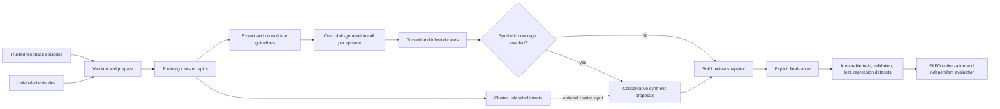

<!--
Copyright 2026 Cisco Systems, Inc. and its affiliates

SPDX-License-Identifier: Apache-2.0
-->

# FAFO Data Pipeline

## Purpose

The FAFO data pipeline turns a small collection of trusted, feedback-labeled
agent episodes and a larger collection of unlabeled episodes into a versioned
evaluation asset. The resulting cases and rubrics can be used by FAFO to evaluate prompt
or skill variants without treating an agent's historical behavior as ground
truth.

This document describes the FAFO data pipeline. The input
schema is defined separately in the
[`fafo-evaluation-input-v1` contract](evaluation-input-contract.md).

The design separates three kinds of information:

- Trusted feedback provides reusable evidence about expected behavior.
- Complete episodes provide case-specific facts, requests, tool observations,
  and outcomes.
- Intent clusters provide sampling and analysis metadata only. They do not
  determine correctness or guideline applicability.

## End-to-End Flow



In compact form:

1. Validate and copy the source episodes into a self-contained asset.
2. Redact content, derive split-isolation groups, and assign trusted splits.
3. Extract evidence-backed guidelines from eligible training feedback only.
4. Optionally cluster unlabeled intent text for later sampling and analysis.
5. Optionally persist cluster metadata without making policy decisions.
6. Give every episode and the complete permitted guideline catalog to one LLM
   call, which selects applicable guidelines and writes a case-specific rubric.
7. Optionally propose narrowly constrained synthetic cases, then construct the
   fingerprinted review snapshot.
8. Explicitly finalize and publish immutable dataset splits.

## What the Pipeline Produces

An evaluation asset contains:

- a reusable training guideline catalog;
- one case-specific rubric for every scoreable trusted or unlabeled episode;
- trusted cases, inferred cases, and optionally synthetic cases;
- optional cluster membership and representatives for sampling;
- complete provenance and dependency fingerprints;
- held-item and review records;
- immutable train, validation, test, and trusted-regression datasets.

The asset defines evaluation requirements. A downstream judge must still
score a candidate agent's newly produced trajectory against each case rubric.
The historical assistant response is evidence for authoring; it is not the
response that FAFO should optimize toward.

## Inputs

Asset creation requires two nonempty JSONL files:

| Input | Required contents | Role |
|---|---|---|
| Trusted feedback | Complete episode, assistant output, and feedback polarity; rationale or checks when available | Extract reusable guidelines and create trusted case rubrics |
| Unlabeled traffic | Complete episode without feedback | Represent real traffic and create inferred case rubrics |

Every row must conform to
[`fafo-evaluation-input-v1`](evaluation-input-contract.md). Core fields include
`record_id`, `group_id`, `task_type`, `user_input`, `conversation_context`,
`tool_calls`, `runtime`, and `metadata`. Feedback rows additionally require an
`assistant_output` and feedback with a polarity; rationale is optional. The optional
`episode` field preserves the complete ordered sequence of messages, tool
calls, and tool results, including call/result linkage.

Source files must be ordinary `.jsonl` files beneath the selected tenant's
`source_artifacts/` or normal `datasets/` directory. Cross-tenant paths,
symlink escapes, generated evaluation-asset outputs, and external paths are
rejected. After creation, every stage reads the copied inputs inside the asset
workspace rather than the original source files.

### Feedback eligibility

A trusted row with valid feedback polarity can influence guideline creation
and receive a trusted case rubric. A nonempty rationale, material correction,
or declared deterministic or executable check gives the authoring model more
specific evidence. With polarity alone, the model must preserve uncertainty
about the cause of the rating and ground requirements in the explicit request
and observable trace.

### Intent text

The clustering embedding is built from all user messages in episode order.
Repeated user messages are retained. When episode messages are available, they
are authoritative; otherwise the canonical user-facing fields are used.

Assistant messages, tool arguments, and tool results are deliberately excluded
from the embedding text because they describe what the historical agent did,
not just what the user intended. Tool names may be retained as structural
metadata but are not part of the intent embedding.

## Trust and Evidence Model

| Evidence | What it can establish | What it cannot establish by itself |
|---|---|---|
| Trusted user or SME feedback | A supported success, error, or expected repair | Facts not stated or supported by the episode |
| Tool call | The action the agent attempted | That the action was appropriate or succeeded |
| Tool result | The outcome the environment reported | That the agent chose the correct action |
| Runtime/environment event | An observed execution condition | Agent culpability without supporting evidence |
| Historical assistant response | What the agent said or did | The correct answer merely because it occurred |
| Unlabeled trace | Case facts and observed outcomes | New reusable policy or correctness truth |

The pipeline distinguishes agent behavior from environment failure and records
uncertainty when causality is not supported. It never silently turns observed
behavior into a rule.

## Split Isolation Happens Before Authoring

Stage 2 derives a `split_group_id` while preserving the supplied `group_id`.
Records connected by exact canonical model-visible context or a supplied group
are assigned together. Trusted connected components are deterministically
assigned from the split seed before any guideline or rubric model call:

| Trusted partition | Hash interval | Approximate target |
|---|---:|---:|
| `regression_trusted` | `[0.00, 0.20)` | 20% |
| `train` | `[0.20, 0.68)` | 48% |
| `validation` | `[0.68, 0.84)` | 16% |
| `test` | `[0.84, 1.00)` | 16% |

Actual counts can differ because connected groups are indivisible. Derived
families that are not attached to a trusted split use a deterministic 60/20/20
train/validation/test assignment. Critically, derived cases never enter
`regression_trusted`; a derived case connected to regression is held instead.

This ordering prevents test or regression feedback from becoming reusable
training guidance. Protected feedback may be used only to author the rubric for
its owning held-out episode. Except for that single Stage 6 call, isolation
controls never expose protected criteria to Stages 5–7, later provider payloads, or API previews
for any other record.

## The Eight Stages

| Stage | Behavior | Main outputs |
|---|---|---|
| 1. `raw_inputs` | Copy, validate, count, and hash both sources; validate cluster feasibility when clustering is enabled | Copied source JSONL and validation receipt |
| 2. `prepared_inputs` | Redact content, normalize defaults, check IDs, build split groups and trusted split plan, assess feedback eligibility, and construct user-message intent text | Normalized records, intent records, eligibility and split plans |
| 3. `rubric_extraction` | Extract trace-grounded evidence from eligible training feedback and consolidate compatible evidence into reusable guidelines; compile protected guidance separately | Public guideline catalog, protected guideline artifacts, evidence and candidate inventories |
| 4. `intent_clustering` | Optionally embed unlabeled intent text and perform deterministic route-local clustering | Cluster assignments, representatives, top terms, embedding metadata; empty inventory when disabled |
| 5. `coverage_decisions` | Optionally persist cluster sampling context only; make no matching, support, or correctness decisions | `cluster_sampling_metadata.jsonl`; empty when disabled |
| 6. `label_inference` | Make exactly one rubric-generation call per episode with the full split-permitted catalog and complete episode evidence | Episode rubrics, trusted/inferred cases, dependencies, held outputs |
| 7. `synthetic_coverage` | Optionally generate conservative synthetic proposals, apply mechanical filters, form exact-context families, fingerprint eligible items, and auto-approve scoreable derived cases | Synthetic artifacts, review decisions, holds, dependencies |
| 8. `dataset_splits` | After explicit finalization, publish trusted plus approved derived cases while excluding held or rejected items | Immutable datasets and release manifest |

The persisted Stage 3 enum remains `rubric_extraction` for compatibility. Its
product is evaluation-guideline creation, and its canonical directory is
`03_evaluation_guidelines`.

## Stage 3: Guideline Extraction

### Evidence extraction

For each eligible training feedback episode, the model receives the feedback
and the ordered trace, including assistant messages, tool calls, tool results,
and relevant runtime observations. Where the feedback supports a specific
behavioral conclusion, it must:

1. identify the behavior praised or criticized;
2. point to the feedback and observable trace evidence;
3. describe the expected repair or preserved behavior;
4. recognize recurring mistake or success patterns when supported;
5. distinguish an agent error from an environment or tool failure; and
6. retain uncertainty instead of inventing a causal explanation.

The extraction step makes tool activity first-class evidence. For example, a
tool result can prove that a mutation succeeded or failed, while detailed
feedback can establish whether attempting that mutation was appropriate. A
polarity-only rating records overall satisfaction or dissatisfaction without
identifying the responsible action or a specific repair.

### Consolidation

Compatible evidence is synthesized into reusable guidelines. This is why 35
feedback episodes do not necessarily produce 35 guidelines: multiple episodes
may support the same behavioral requirement. The catalog preserves source IDs
so every eligible training feedback record remains traceable to the evidence it
contributed.

Guidelines should be specific enough to judge behavior but reusable across
cases. They must not copy accidental details, create unsupported policy, or
collapse conflicting evidence into a falsely certain rule.

### Protected held-out guidance

Validation, test, and regression feedback is processed separately within its
assigned split, route, original group, and derived split group. A protected
guideline is visible only to the Stage 6 call for its owning episode. It is not
added to the public catalog and cannot influence another episode.

## Stages 4 and 5: Clustering as Metadata

Clustering answers “which user requests are semantically similar?” It does not
answer “which guideline applies?”

The default is 50 clusters. Set `--clusters 0` (or API `cluster_count: 0`)
to skip both stages. Their receipts and empty JSONL artifacts preserve the
eight-stage workspace shape.
No embedding provider call or cluster sampling occurs. Stage 6 reads neither
Stage 4 nor Stage 5 and builds the same episode rubric inputs from Stage 2
records and Stage 3 guidelines. Synthetic coverage requires clustering and
therefore rejects `cluster_count: 0` when enabled.

The review provenance format retains a `source_cluster` field for compatibility;
inferred cases use an episode-local identifier there, independent of Stage 4.

The pipeline uses clusters for:

- representative and diverse batch sampling;
- coverage analysis;
- diagnosing underrepresented intent regions; and
- gating the optional synthetic-coverage proposal step.

Stage 5 records the route, task type, group, cluster membership, and cluster
representatives. It does not run an LLM, retrieve or attach guidelines, apply a
similarity threshold, or create a labeling queue. The legacy matching and
deterministic-applicability gates are not part of the pipeline.

## Stage 6: One Case-Specific Rubric Per Episode

The pipeline uses one LLM call for every feedback or unlabeled episode. The call
receives:

- all user and assistant messages;
- tool calls, observations, and results;
- relevant runtime context;
- trusted feedback when the episode is eligible; and
- the complete guideline catalog permitted for that episode's split.

The model returns a strict object containing:

- `record_id`;
- zero, one, or many `applicable_guideline_ids`;
- `provenance`;
- an `intent_label` and confidence;
- `must`, `must_not`, and `should` requirements;
- deterministic checks and tool expectations;
- an optional reference output; and
- evidence pointers.

Unknown or duplicate guideline IDs are rejected, and the output provenance is
enforced mechanically.

### Two rubric modes

`guideline_grounded` is used when at least one guideline applies. Requirements
come from the selected guidelines; episode evidence supplies the case facts and
observed outcome, not new policy.

`trace_inferred` is used when no guideline applies. The model infers a
case-specific rubric from the explicit user request, available policy or tool
constraints, and tool-backed outcomes. It must not assume that the historical
agent response was correct. Trace-inferred rubrics are derived evaluation
assets, not new trusted guidelines.

This design lets all guidelines be considered in a single bounded call instead
of paying for a separate applicability call per guideline or relying on brittle
similarity alone.

## Stage 7: Optional Synthetic Coverage and Review

Synthetic coverage is disabled by default. Synthetic proposals are requested only for clusters with a scoreable inferred rubric
for every member. Here, “inferred rubric” means a rubric produced by Stage 6;
each member must have `guideline_grounded` provenance, and all rubric signatures
must be identical. They do not define new trusted intents or correctness criteria.

When enabled, Stage 7 applies only mechanical checks that the implementation can
honestly enforce:

- schema validity;
- nonempty context and scoreable requirements;
- narrow literal leakage detection for substantive copied strings; and
- a token-set Jaccard limit below `0.95`.

These checks do not prove semantic correctness, factuality, safety, privacy, or
real-world plausibility. Rejected proposals and issues remain in the asset for
audit.

Stage 7 also builds exact canonical-context duplicate families and holds entire
families when exact contexts imply conflicting trusted truth. It creates full
dependency descriptors and content fingerprints for every reviewable derived
case.

Mechanically accepted synthetic items and scoreable inferred items are automatically approved by the pipeline.
Unscoreable rubrics, ineligible feedback, conflicting exact-context families,
and derived cases attached to regression remain held. Automatic approval is a
pipeline status, not a claim that every LLM-authored rubric is infallible; the
fingerprinted review snapshot remains inspectable before release.

After Stage 7 commits, the asset pauses in `awaiting_review`.

## Stage 8: Finalization and Publication

Publication requires an explicit finalization bound to both:

- the current `review_set_fingerprint`, covering review items, dependencies,
  and holds; and
- the current `decision_set_fingerprint`, covering resolved decisions.

Stage 8 publishes all eligible trusted cases and only approved, non-held
derived cases. Pending, rejected, and held items remain auditable but are not
published. The release is installed as an immutable content-addressed
generation; `release.json` points consumers to that generation.

The four consumer partitions are:

- `train` for optimizer updates;
- `validation` for variant selection and plateau decisions;
- `test` for a final in-asset check; and
- `regression_trusted` for trusted regression protection.

An independent native-environment holdout should remain outside the asset and
be evaluated only after selecting a candidate.

## Workspace and Important Artifacts

```text
tenants/<tenant_id>/evaluation_assets/<asset_id>/
├── config.json
├── config_history.jsonl
├── pipeline_state.json
├── events.jsonl
├── recovery_journal.jsonl
├── receipts/
├── reviews/
│   ├── decisions.jsonl
│   └── finalizations.jsonl
├── stages/
│   ├── 01_raw_inputs/
│   ├── 02_prepared_inputs/
│   ├── 03_evaluation_guidelines/
│   ├── 04_intent_clustering/
│   ├── 05_coverage_decisions/
│   ├── 06_label_inference/
│   ├── 07_synthetic_coverage/
│   └── 08_dataset_splits/
├── asset_manifest.json
├── release.json
├── lineage.json          # extensions only
└── reuse_manifest.json   # extensions only
```

Each stage writes its own artifacts and an atomic receipt. `events.jsonl`
provides append-only operational history. Provider calls are recorded in local
request/response logs with secret-bearing headers excluded.

## Running the Pipeline

Install the project environment, set the credential for the selected rubric
and embedding providers, and create the asset:

```bash
export OPENAI_API_KEY="<your-openai-api-key>"

python -m hephaestus.cli assets create \
  --tenant <tenant_id> \
  --asset-id v1 \
  --feedback <labeled_feedback.jsonl> \
  --unlabeled <unlabeled.jsonl> \
  --rubric-model gpt-6-luna \
  --embedding-model text-embedding-3-small \
  --clusters 20

python -m hephaestus.cli assets run \
  --tenant <tenant_id> \
  --asset-id v1
```

Use `--embedding-model tfidf` for deterministic local vectorization without an
embedding API call. Use `--enable-synthetic-coverage` and
`--synthetic-cases-per-cluster <count>` only when synthetic expansion is
desired. Provider failures are surfaced; FAFO does not silently switch models
or enable clustering. `--clusters 0` skips Stages 4 and 5; it is incompatible
with synthetic coverage.

The CLI still accepts legacy matching/support settings so older asset
configurations remain readable. The pipeline does not use `match_threshold`,
`min_trusted_examples`, `min_trusted_groups`, or
`max_unlabeled_to_trusted_ratio` to create rubrics.

### Inspect and finalize

The run returns after Stage 7. Inspect the bounded review snapshot and capture
both fingerprints:

```bash
python -m hephaestus.cli assets reviews list \
  --tenant <tenant_id> \
  --asset-id v1
```

Scoreable inferred cases and mechanically accepted synthetic cases
are already approved. `assets reviews approve` and `assets reviews reject`
remain available for pending items in compatible or historical workflows; a
decision must include the exact case fingerprint and current review-set
fingerprint.

Finalize the exact snapshot:

```bash
python -m hephaestus.cli assets reviews finalize \
  --tenant <tenant_id> \
  --asset-id v1 \
  --reviewer <reviewer_name> \
  --review-set <sha256:review_set_fingerprint> \
  --decision-set <sha256:decision_set_fingerprint>
```

Finalization does not convert held or rejected cases into published cases.

## Cost and Scalability

The main model costs are predictable:

- Stage 3: batched evidence extraction and guideline synthesis over eligible
  trusted feedback;
- Stage 4: batched embeddings for unlabeled user-message intent text when enabled;
- Stage 6: exactly one rubric-model call per episode; and
- Stage 7: calls only for eligible clusters when synthetic coverage is enabled.

There is no pairwise episode-guideline LLM gate. Passing the complete permitted
catalog makes Stage 6 cost scale with episode count and catalog prompt size,
rather than the product of episodes and candidate guidelines. If the catalog
eventually becomes too large for a model context window, add a separately
validated retrieval layer; preserve the pipeline's evidence semantics.

## Resume, Revision, and Extension

A mutable run verifies the completed receipt prefix and resumes from the first
incomplete or invalid stage. Configuration changes invalidate from the earliest
affected stage:

- split seed from Stage 2;
- guideline/rubric model from Stage 3;
- embedding model or cluster count from Stage 4; and
- synthetic settings from Stage 7.

Released assets are immutable. Extend one into a child asset instead:

```bash
python -m hephaestus.cli assets extend \
  --tenant <tenant_id> \
  --parent-asset-id v1 \
  --asset-id v2 \
  --additional-feedback <additional_feedback.jsonl> \
  --clustering-mode keep
```

`keep` accepts labeled additions and preserves the parent's clustering plan.
`refresh` accepts feedback and/or unlabeled additions and reclusters the
combined unlabeled pool. Parent split assignments are inherited. A new record
that bridges incompatible parent splits fails closed. Because Stage 6 considers
the complete permitted catalog, adding feedback can legitimately regenerate
episode rubric dependencies even when clusters are kept.

## Using the Asset with FAFO

A typical experimental loop is:

1. Evaluate the baseline agent on the asset validation/regression cases and an
   untouched native-environment holdout.
2. Optimize only the authorized prompt or skill using the `train` cases.
3. Select variants using `validation` while enforcing `regression_trusted`.
4. Stop at a predefined plateau rule or budget.
5. Evaluate the selected candidate once on `test` and the independent native
   holdout under fixed model, temperature, policy, tools, simulator, and task
   split settings.

When comparing trusted-only, mixed trusted-plus-inferred, and staged arms, keep
the held-out protocol fixed and report agent-inference budget separately from
pipeline authoring cost.

## Integrity and Security Boundaries

- Content-bearing values are redacted recursively before provider use; stable
  structural IDs, message roles, routes, and tool names remain available where
  required for provenance.
- No API keys or provider authorization headers are persisted in artifacts.
- Stage receipts bind input and output hashes, resolved configuration,
  algorithm identity, and provider/prompt metadata.
- Review decisions bind exact case and dependency fingerprints.
- Exact-context and supplied-group families cannot cross partitions.
- Protected held-out criteria cannot enter public guidance or unrelated model
  payloads.
- Released generations are immutable and verified before extension.

These controls provide reproducibility, isolation, and traceability. They do
not prove that an LLM-created rubric is semantically perfect. Sampled human
audits and independent native scoring remain important validation layers.

## Operational Checklist

Before running:

- validate both inputs against the canonical contract;
- confirm feedback has valid polarity and include rationales, corrections, or
  checks when available;
- choose and record the rubric model, split seed, and whether to enable
  clustering with a positive cluster count;
- keep all source episodes under the correct tenant; and
- reserve an independent native-environment holdout.

Before finalizing:

- inspect guideline source coverage and consolidation;
- sample both `guideline_grounded` and `trace_inferred` rubrics;
- inspect held cases and exact-context conflicts;
- confirm protected feedback did not enter the public catalog;
- record the review and decision fingerprints; and
- verify split counts and group isolation.

Before claiming an optimization improvement:

- compare against the fixed baseline;
- use the same agent model, temperature, tools, policy, and simulator;
- report validation, regression, and native holdout metrics separately; and
- distinguish trusted-only, mixed, and staged optimization arms.

## Related Documentation

- [Evaluation input contract](evaluation-input-contract.md)
- [Evaluation Asset Studio stress test](evaluation-asset-studio-stress-test.md)
- [Tenant model](../tenant-model.md)
- [Optimization loop](prompt-iteration-loop.md)
